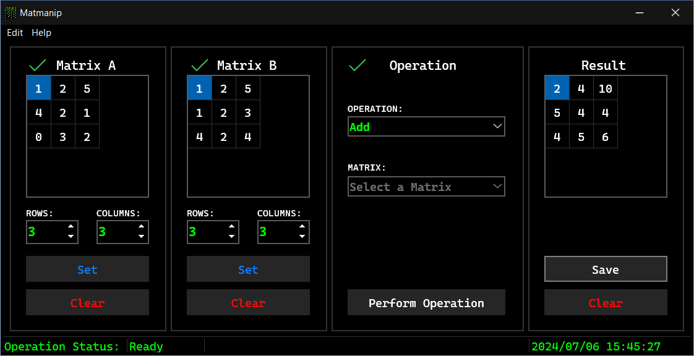

# Matmanip
Matmanip is a basic Pascal program that allows you to manipulate matrices.  

## Features
With Matmanip you can add, subtract and multiply matrices. You can also transpose and inverse them. 

## Screenshot

